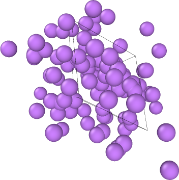

# Lithium Molecular Dynamics Simulation

Beginner Molecular Dynamics simulation project using ASE and OVITO for lithium crystal modeling and atomistic simulations.

---

## Features

- Lithium BCC crystal generation
- FIRE energy minimization
- Molecular Dynamics simulation
- OVITO visualization
- Analysis of Lennard-Jones instability
- Planned EAM extension

---

## Tools Used

- Python
- ASE
- OVITO
- NumPy
- Matplotlib
- SciPy

---

## Physics Concepts

- Crystal structures
- Lennard-Jones potential
- Molecular Dynamics
- Velocity-Verlet integration
- Energy minimization
- Thermal motion
- Interatomic forces

---

## Observations

The lithium crystal became unstable during simulation because the Lennard-Jones potential is not physically suitable for metallic lithium.

This demonstrated the importance of realistic interatomic potentials in computational materials science.

---

## Future Work

- Implement EAM potentials
- Add diffusion calculations
- Compute Mean Squared Displacement (MSD)
- Study lithium-ion transport
- Move toward battery-material simulations

---

## Visualization

Simulation trajectories were visualized using OVITO.

---

## Simulation Snapshot

The image below shows instability in the lithium crystal during Molecular Dynamics simulation using the Lennard-Jones potential.

This demonstrated that Lennard-Jones is not physically suitable for metallic lithium systems.

## Author

Kashmira Kudche